# (CVPR 2022) TokenCut
Pytorch implementation of **Tokencut**:


**Self-supervised Transformers for Unsupervised Object Discovery using Normalized Cut**

*[Yangtao Wang](https://yangtaowang95.github.io), [Xi Shen](https://xishen0220.github.io/), [Shell Xu Hu](http://hushell.github.io/), [Yuan Yuan](https://yyuanad.github.io/), [James L. Crowley](http://crowley-coutaz.fr/jlc/jlc.html), [Dominique Vaufreydaz](https://research.vaufreydaz.org/)*


[[Project page](https://www.m-psi.fr/Papers/TokenCut2022/)]
[[ Github (Video Segmentation) ](https://github.com/YangtaoWANG95/TokenCut_video)]
[[Paper](https://arxiv.org/pdf/2202.11539.pdf)]
[](https://colab.research.google.com/github/YangtaoWANG95/TokenCut/blob/master/inference_demo.ipynb)
[](https://huggingface.co/spaces/akhaliq/TokenCut)

<p align="center">
  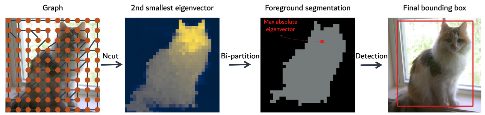
</p>

If our project is helpful for your research, please consider citing : 
``` 
@inproceedings{wang2022tokencut,
          title={Self-supervised Transformers for Unsupervised Object Discovery using Normalized Cut},
          author={Wang, Yangtao and Shen, Xi and Hu, Shell Xu and Yuan, Yuan and Crowley, James L. and Vaufreydaz, Dominique},
          booktitle={Conference on Computer Vision and Pattern Recognition}
          year={2022}
        }
```


## Table of Content
* [1. Updates](#1-updates)
* [2. Installation](#2-installation)
  * [2.1 Dependencies](#21-dependencies)
  * [2.2 Data](#22-data)
* [3. Quick Start](#3-quick-start)
  * [3.1 Detecting an object in one image](#31-detecting-an-object-in-one-image)
  * [3.2 Segmenting a salient region in one image](#32-segmenting-a-salient-region-in-one-image)
* [4. Evaluation](#4-evaluation)
  * [4.1 Unsupervised object discovery](#41-unsupervised-object-discovery)
  * [4.2 Unsupervised saliency detection](#42-unsupervised-saliency-detection)
  * [4.3 Weakly supervised object detection](#43-weakly-supervised-object-detection)
* [5. Acknowledgement](#5-acknowledgement)

## 1. Updates

***09/06/2022***
Extension work of [TokeCut Video Segmentation](https://github.com/YangtaoWANG95/TokenCut_video) is realised! 

***03/10/2022***
Creating a 480p Demo using [Gradio](https://github.com/gradio-app/gradio). Try out the Web Demo: [](https://huggingface.co/spaces/yangtaowang/TokenCut)

Internet image results:
<p >
  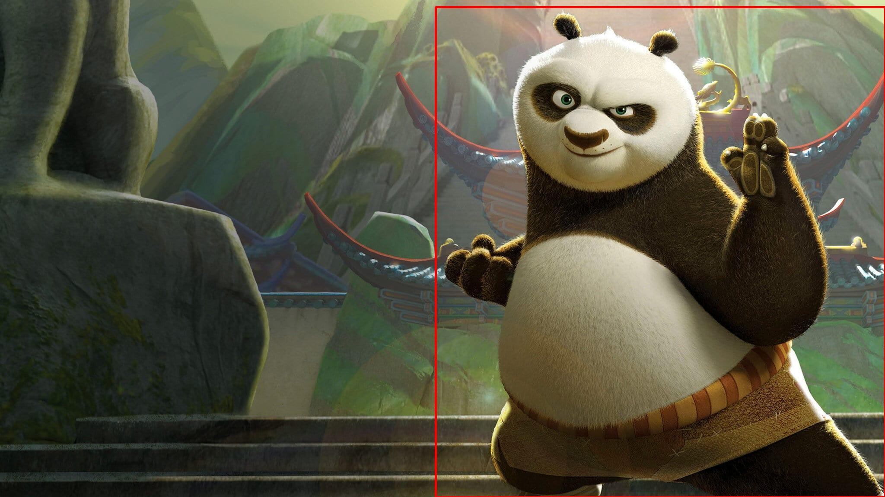
  
  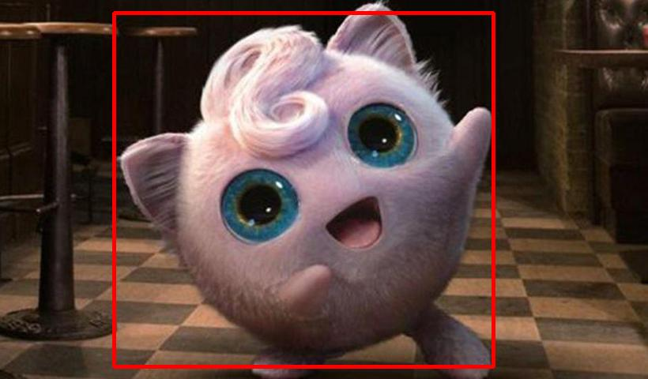
  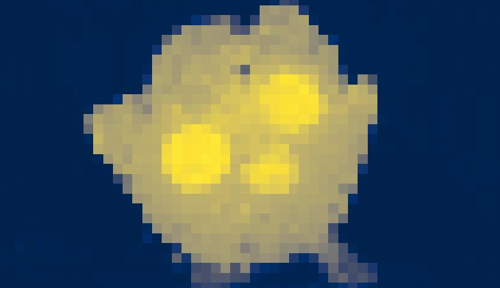
</p>

***02/26/2022***
Integrated into [Huggingface Spaces 🤗](https://huggingface.co/spaces) using [Gradio](https://github.com/gradio-app/gradio). Try out the Web Demo: [](https://huggingface.co/spaces/akhaliq/TokenCut)

***02/26/2022***
A simple TokenCut Colab Demo is available. 

***02/21/2022***
Initial commit: Code of TokenCut is released, including evaluation of unsupervised object discovery, unsupervised saliency object detection, weakly supervised object locolization.

## 2. Installation
### 2.1 Dependencies

This code was implemented with Python 3.7, PyTorch 1.7.1 and CUDA 11.2. Please refer to [the official installation](https://pytorch.org/get-started/previous-versions/). If CUDA 10.2 has been properly installed : 
```
pip install torch==1.7.1 torchvision==0.8.2
```


In order to install the additionnal dependencies, please launch the following command:

```
pip install -r requirements.txt
```


### 2.2 Data

We provide quick download commands in [DOWNLOAD_DATA.md](./DOWNLOAD_DATA.md) for VOC2007, VOC2012, COCO, CUB, ImageNet, ECSSD, DUTS and DUT-OMRON as well as DINO checkpoints.


## 3. Quick Start

### 3.1 Detecting an object in one image

We provide TokenCut visualization for bounding box prediction and attention map. Using `all` for all visualization results. 
<!--Following are scripts to apply TokenCut to an image defined via the `image_path` parameter and visualize the predictions (`pred`), the eigen attention map of the Figure 3 in the paper (`attn`), and all the figures(`all`). Box predictions are also stored in the output directory given by parameter `output_dir`. -->

```
python main_tokencut.py --image_path examples/VOC07_000036.jpg --visualize pred
python main_tokencut.py --image_path examples/VOC07_000036.jpg --visualize attn
python main_tokencut.py --image_path examples/VOC07_000036.jpg --visualize all 
```

### 3.2 Segmenting a salient region in one image

We provide TokenCut segmentation results as follows:

```
cd unsupervised_saliency_detection 
python get_saliency.py --sigma-spatial 16 --sigma-luma 16 --sigma-chroma 8 --vit-arch small --patch-size 16 --img-path ../examples/VOC07_000036.jpg --out-dir ./output
```

## 4. Evaluation
Following are the different steps to reproduce the results of **TokenCut** presented in the paper.

### 4.1 Unsupervised object discovery


<p align="center">
  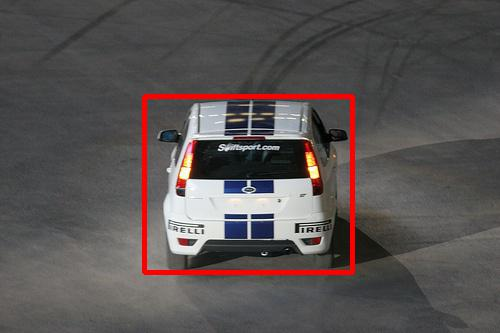
  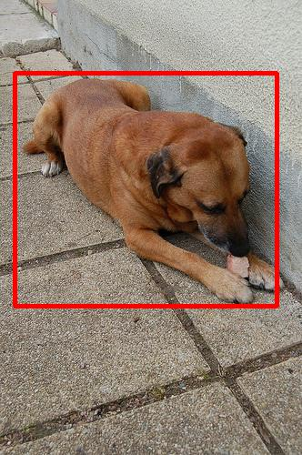
  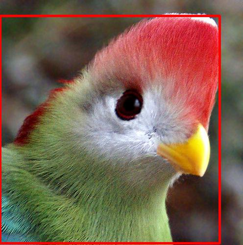
</p>

#### PASCAL-VOC
In order to apply TokenCut and compute corloc results (VOC07 68.8, VOC12 72.1), please launch:
```
python main_tokencut.py --dataset VOC07 --set trainval
python main_tokencut.py --dataset VOC12 --set trainval
```

If you want to extract Dino features, which corresponds to [the KEY features in DINO](https://github.com/XiSHEN0220/LOST/blob/main/main_lost.py#L259-L261): 
```
mkdir features
python main_lost.py --dataset VOC07 --set trainval --save-feat-dir features/VOC2007
```

#### COCO

Results are provided given the 2014 annotations following previous works. The following command line allows you to get results on the subset of 20k images of the COCO dataset (corloc 58.8), following previous litterature. To be noted that the 20k images are a subset of the `train` set.
```
python main_tokencut.py --dataset COCO20k --set train
```

#### Different models
We have tested the method on different setups of the VIT model, corloc results are presented in the following table (more can be found in the paper).

<table>
  <tr>
    <th>arch</th>
    <th>pre-training</th>
    <th colspan="3">dataset</th>
  </tr>
  <tr>
    <th></th>
    <th></th>
    <th>VOC07</th>
    <th>VOC12</th>
    <th>COCO20k</th>
  </tr>
  <tr>
    <td>ViT-S/16</td>
    <td>DINO</td>
    <td>68.8</td>
    <td>72.1</td>
    <td>58.8</td>
  <tr>
  <tr>
    <td>ViT-S/8</td>
    <td>DINO</td>
    <td>67.3</td>
    <td>71.6</td>
    <td>60.7</td>
  <tr>
  <tr>
    <td>ViT-B/16</td>
    <td>DINO</td>
    <td>68.8</td>
    <td>72.4</td>
    <td>59.0</td>
  <tr>
</table>


Previous results on the dataset `VOC07` can be obtained by launching:
```
python main_tokencut.py --dataset VOC07 --set trainval #VIT-S/16
python main_tokencut.py --dataset VOC07 --set trainval --patch_size 8 #VIT-S/8
python main_tokencut.py --dataset VOC07 --set trainval --arch vit_base #VIT-B/16
```

### 4.2 Unsupervised saliency detection

<p align="center">
  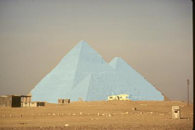
  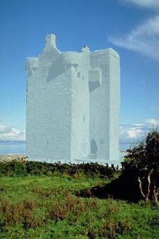
  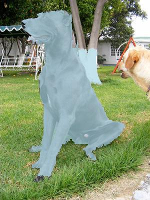
</p>

To evaluate on ECSSD, DUTS, DUT_OMRON dataset:
```
python get_saliency.py --out-dir ECSSD --sigma-spatial 16 --sigma-luma 16 --sigma-chroma 8 --nb-vis 1 --vit-arch small --patch-size 16 --dataset ECSSD

python get_saliency.py --out-dir DUTS --sigma-spatial 16 --sigma-luma 16 --sigma-chroma 8 --nb-vis 1 --vit-arch small --patch-size 16 --dataset DUTS

python get_saliency.py --out-dir DUT --sigma-spatial 16 --sigma-luma 16 --sigma-chroma 8 --nb-vis 1 --vit-arch small --patch-size 16 --dataset DUT
```
This should give:

<table>
  <tr>
    <th>Method</th>
    <th colspan="3"> ECSSD</th>
    <th colspan="3"> DUTS</th>
    <th colspan="3"> DUT-OMRON</th>
  </tr>
  <tr>
    <th></th>
    <th>maxF</th>
    <th>IoU</th>
    <th>Acc</th>
    <th>maxF</th>
    <th>IoU</th>
    <th>Acc</th>
    <th>maxF</th>
    <th>IoU</th>
    <th>Acc</th>
  </tr>
  <tr>
    <td>TokenCut</td>
    <td>80.3</td>
    <td>71.2</td>
    <td>91.8</td>
    <td>67.2</td>
    <td>57.6</td>
    <td>90.3</td>
    <td>60.0</td>
    <td>53.3</td>
    <td>88.0</td>
  <tr>
  <tr>
    <td>TokenCut + BS</td>
    <td>87.4</td>
    <td>77.2</td>
    <td>93.4</td>
    <td>75.5</td>
    <td>62,4</td>
    <td>91.4</td>
    <td>69.7</td>
    <td>61.8</td>
    <td>89.7</td>
  </tr>
</table>

### 4.3 Weakly supervised object detection

<p align="center">
  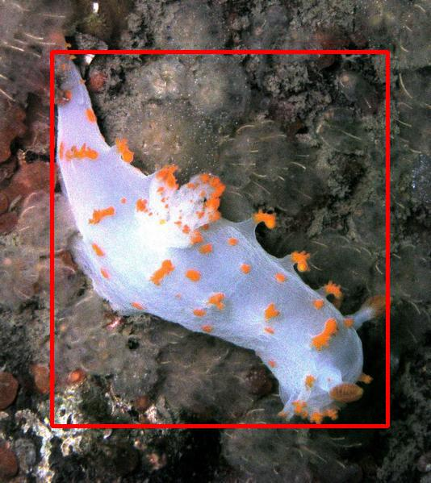
  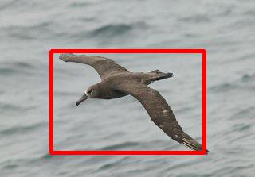
  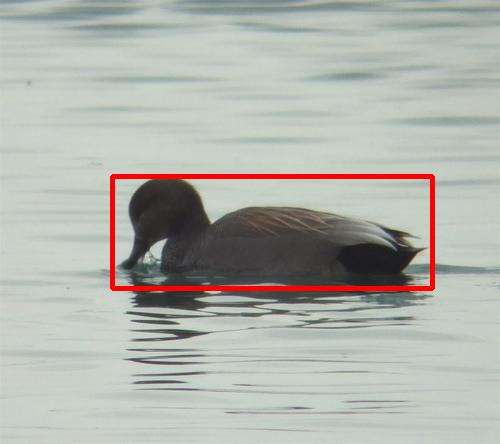

</p>


#### Fintune DINO small on CUB

To finetune ViT-S/16 on CUB on a single node with 4 gpus for 1000 epochs run:
```
python -m torch.distributed.launch --nproc_per_node=4 main.py --data_path /path/to/data --batch_size_per_gpu 256 --dataset cub --weight_decay 0.005 --pretrained_weights ./dino_deitsmall16_pretrain.pth --epoch 1000 --output_dir ./path/to/checkpoin --lr 2e-4 --warmup-epochs 50 --num_labels 200 --num_workers 16 --n_last_blocks 1 --avgpool_patchtokens true --arch vit_small --patch_size 16
```

#### Evaluation on CUB
To evaluate a fine-tuned ViT-S/16 on CUB val with a single GPU run:
```
python eval.py --pretrained_weights ./path/to/checkpoint --dataset cub --data_path ./path/to/data --batch_size_per_gpu 1 --no_center_crop
```
This should give:
```
Top1_cls: 79.12, top5_cls94.80, gt_loc: 0.914, top1_loc:0.723
```

#### Evaluate on Imagenet

To Evaluate ViT-S/16 finetuned on ImageNet val with a single GPU run:
```
python eval.py --pretrained_weights /path/to/checkpoint --classifier_weights /path/to/linear_weights--dataset imagenet --data_path ./path/to/data --batch_size_per_gpu 1 --num_labels 1000 --batch_size_per_gpu 1 --no_center_crop --input_size 256 --tau 0.2 --patch_size 16 --arch vit_small
```

## 5. Acknowledgement

TokenCut code is built on top of [LOST](https://github.com/valeoai/LOST), [DINO](https://github.com/facebookresearch/dino), [Segswap](https://github.com/XiSHEN0220/SegSwap), and [Bilateral_Sovlver](https://github.com/poolio/bilateral_solver). We would like to sincerely thanks those authors for their great works. 


